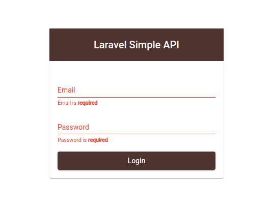
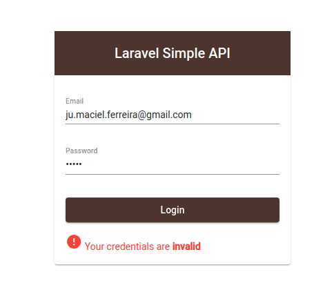

# Frontend for the [Simple API using Laravel Lumen](https://github.com/julianomacielferreira/laravel-api-backend)

This project was generated with [Angular CLI](https://github.com/angular/angular-cli) version 10.2.0.

## Screenshots

|            Login Form             |             Required              |              Invalid              |
| :-------------------------------: | :-------------------------------: | :-------------------------------: |
|  |  |  |

## Development server

Run `ng serve` for a dev server. Navigate to `http://localhost:4200/`. The app will automatically reload if you change any of the source files.

## Code scaffolding

Run `ng generate component component-name` to generate a new component. You can also use `ng generate directive|pipe|service|class|guard|interface|enum|module`.

## Build

Run `ng build` to build the project. The build artifacts will be stored in the `dist/` directory. Use the `--prod` flag for a production build.

## Running unit tests

Run `ng test` to execute the unit tests via [Karma](https://karma-runner.github.io).

## Running end-to-end tests

Run `ng e2e` to execute the end-to-end tests via [Protractor](http://www.protractortest.org/).

## Further help

To get more help on the Angular CLI use `ng help` or go check out the [Angular CLI Overview and Command Reference](https://angular.io/cli) page.

# References

- [Angular](https://angular.io/)

- [Material Design](https://material.io/)

- [Angular Material](https://material.angular.io/)

- [MATERIAL-UI](https://material-ui.com/customization/color/)

- [Pexels&trade;](https://www.pexels.com/)

- [Sass&trade;](https://sass-lang.com/)

- [Webpack&trade;](https://webpack.js.org/)

- [Angular Login App with JWT token authentication](https://www.youtube.com/watch?v=BZ_91HKzNDM)

- [JWT Authorization | Angular Router Guards | Token Refresh](https://www.youtube.com/watch?v=F1GUjHPpCLA)

- [Angular login page | Material Design with Flex-Layout | Angular crud application #1](https://www.youtube.com/watch?v=f3shwARuhEM)

- [How to change the Angular material theme in just 5 minutes](https://www.youtube.com/watch?v=NugqJxFYmDM)

- [Angular 8 Admin Dashboard Panel from scratch using Angular Material, highcharts and flex-layout](https://www.youtube.com/watch?v=FP7Hs8lTy1k)

# License

Please see the [license agreement](https://github.com/julianomacielferreira/laravel-api-frontend/blob/master/LICENSE).
